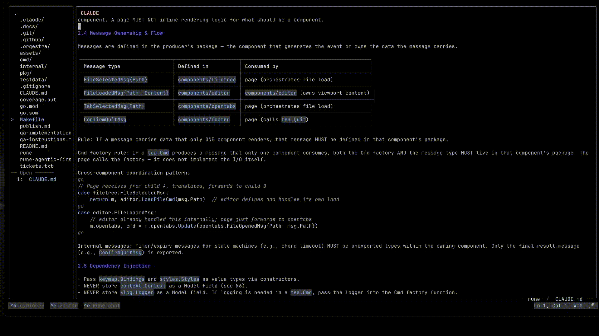
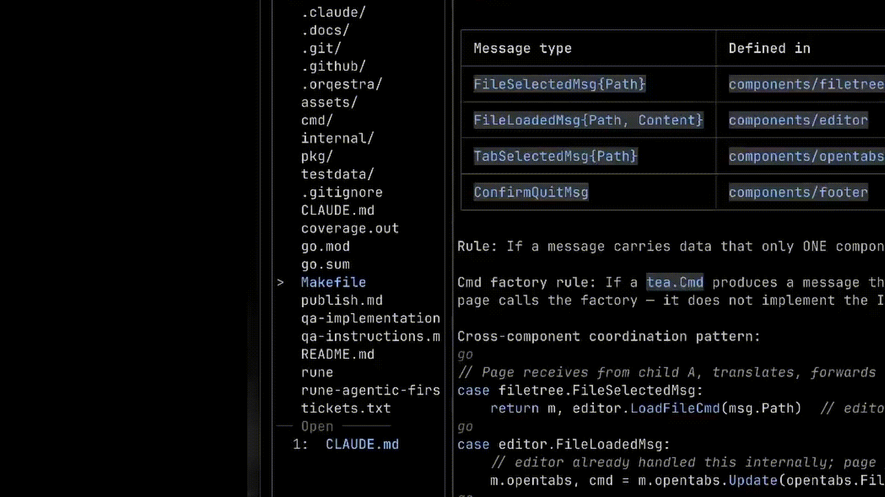
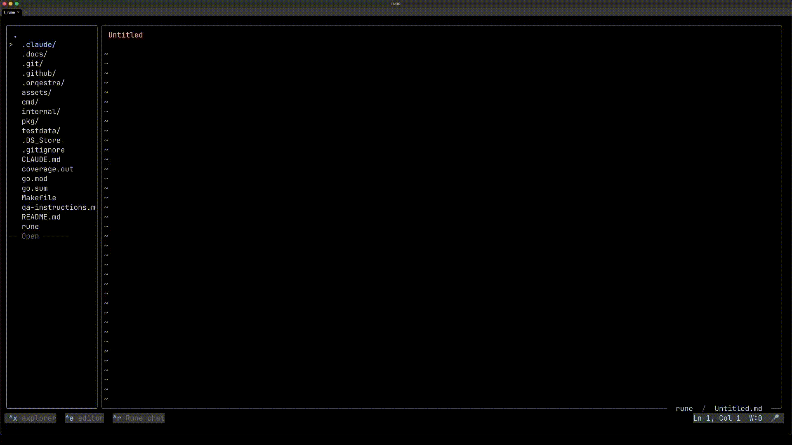

<h1 align="center">rune — Markdown Editor for macOS terminal 📎</h1>

<p align="center"></p>

---

## Good News Everyone

- **MacOS-native** look and feel with familiar **⌘** - combinations
- **Live Markdown Rendering** — Bold, italic, headings, blockquotes, code blocks with syntax highlighting, tables, task lists, horizontal rules, YAML frontmatter, and `[[wikilinks]]`.
- **Voice Dictation** — on your local machine.
- **Task lists** - `- [x] buy milk` syntax
- **Inline Images** — Render PNG, JPEG, GIF (animated), WebP, BMP, TIFF, and even SVG directly in your terminal via the Kitty or iTerm2 graphics protocol.
- **Mouse Support** — Click to focus, drag pane dividers, scroll through files.
- **Obsidian Vault Compatible** — Open any Obsidian vault as-is. Launch Rune from the vault root so `[[wikilinks]]` resolve correctly across your notes.
- **Multi-Cursor Editing** — Add cursors above or below the current line.
- **File Watching** — Auto-reloads files when they change on disk (e.g., from `git checkout` or an external edit).
- **AI Chat** — Talk to an OpenAI-compatible LLM about your notes. The chat pane has context of your open file.

### File Explorer

quick search, just start typing

<p align="center"></p>

### Table rendering

<p align="center"></p>

### Task list

<p align="center"></p>
 
 
---

## Installation

Requires macOS on Apple Silicon (arm64).

```sh
brew tap aka-rider/tap
brew trust aka-rider/tap
brew install --cask rune-edit
```

### Voice input (optional) 

(requires a local whisper.cpp server — **~1.6 GB RAM** while running)
Press `Ctrl+V` to start dictation in the editor or LLM chat.

Rune follows MacOS input language, switch your keyboard language to change dictation language.

```sh
brew install aka-rider/tap/whisper-cpp-server
brew services start aka-rider/tap/whisper-cpp-server
```

First launch downloads ~3 GB of model weights and builds the ANE encoder (~5–10 min).
Subsequent launches are instant.

---

## Keybindings

MacOS-native ⌘+c/v/z, and others should work.
Sometimes, terminal emulator intercepts these combinations. 
Either configure the terminal emulator, or use fallback: ⌘⇧+... or Ctrl+...

For example, select all: ⌘+a, ⌘⇧+a, ^a

Some keybindings may not work with non-English input sources.
For instance, rune receives ⌘+м instead of ⌘+v (Ukrainian keyboard), this is a terminal limitation.

Press `F1` inside Rune for the list of keyboard shortcuts — the help page is generated live from the keymap, so it never drifts.


## Recommended Terminals

| Terminal | Notes |
|----------|-------|
| [Ghostty](https://ghostty.org/) | Focused on compatibility with VT standards |

Kitty, iTerm2, WezTerm work too, with all kinds of bugs. 
rune relies on terminal protocol extensions (super key, image rendering, clipboard, etc.).

## Credits

- [Bubble Tea by charmbracelet](https://github.com/charmbracelet/bubbletea)
- [goldmark by yuin](https://github.com/yuin/goldmark)

---

## [MIT License](LICENSE.txt)
