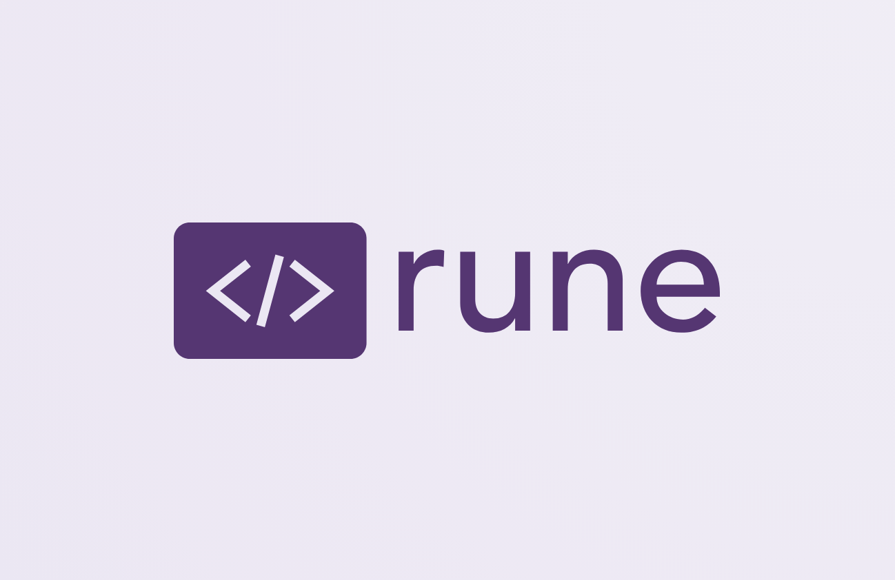

<h1 align="center">📎 rune</h1>
<p align="center"><strong>Digital assistant wannabe</strong></p>
<p align="center"></p>


---

## Good News Everyone

It's like **Obsidian** and **Visual Studio Code** had a baby in your terminal.


- **MacOS-ish** look and feel with **⌘** - combinations
- **Live Markdown Rendering** — Bold, italic, headings, blockquotes, code blocks with syntax highlighting, tables, task lists, horizontal rules, YAML frontmatter, and `[[wikilinks]]`.
- **Voice Dictation** — Speak into your notes. Rune captures your mic, streams audio to a local [whisper.cpp](https://github.com/ggerganov/whisper.cpp) server, and inserts the transcription at your cursor. Auto-detects your keyboard language for better accuracy.
- **Inline Images** — Render PNG, JPEG, GIF (animated), WebP, BMP, TIFF, and even SVG directly in your terminal via the Kitty or iTerm2 graphics protocol.
- **AI Chat** — Talk to an OpenAI-compatible LLM about your notes. The chat pane has context of your open file.
- **Obsidian Vault Compatible** — Open any Obsidian vault as-is. Launch Rune from the vault root so `[[wikilinks]]` resolve correctly across your notes.
- **Tabs, Pin, Zen Mode** — Manage open files with tabs, pin the ones you keep coming back to, and toggle the sidebar for distraction-free writing.
- **Multi-Cursor Editing** — Add cursors above or below the current line.
- **Mouse Support** — Click to focus, drag pane dividers, scroll through files.
- **File Watching** — Auto-reloads files when they change on disk (e.g., from `git checkout` or an external edit).

### File Explorer

quick keyboard navigation, just start typing

<p align="center"></p>

### Task list

<p align="center"></p>


## Yes, But

**It works on my machine (tm)**

It's a combination of

 - Terminal emulator must support Kitty extensions for 
 - Whisper.cpp custom-built for your local hardware
 - MacOS permissions to use Mic
 - Multi-file editing
 
---

## Installation

Ask your agent how to install and set it up


---

## Keybindings

### Application

<details>
<summary>Pane management, focus, and app controls</summary>

| Keys | Action |
|------|--------|
| `Ctrl+x` | Focus file explorer |
| `Ctrl+e` | Focus editor |
| `Ctrl+r` | Focus rune chat |
| `Ctrl+1` … `Ctrl+9` | Switch to tab by index |
| `Ctrl+W` | Close current tab |
| `Ctrl+p` | Pin / unpin current tab |
| `Ctrl+o` | Toggle zen mode (hide sidebar) |
| `Ctrl+v` | Start / stop voice dictation |
| `⌘S`| Save file |
| `?` | Toggle help overlay |
| `Ctrl+c/Ctrl+d` | Quit (press twice to confirm) |
| `Ctrl+c/Ctrl+d` | Quit (press twice to confirm) |


</details>


### Navigation

<details>
<summary>Cursor movement</summary>

| Keys | Action |
|------|--------|
| `↑` / `↓` | Move up / down one line |
| `←` / `→` | Move left / right one character |
| `Home` / `End` | Jump to line start / end |
| `PgUp` / `PgDn` | Page up / down |
| `Ctrl+U` / `Ctrl+D` | Half-page up / down |
| `Alt+←` / `Alt+→` | Jump one word left / right |
| `Shift+↑/↓/←/→` | Select with shift |
| `Shift+Home/End` | Select to line start / end |
| `Shift+PgUp/PgDn` | Select page up / down |
| `Alt+Shift+←/→` | Select one word |
| `⌘A` | Select all |

</details>

### Clipboard

<details>
<summary>Copy, cut, paste</summary>

| Keys | Action |
|------|--------|
| `⇧⌘C` | Copy to clipboard |
| `⌘X` | Cut to clipboard |
| `⌘V` | Paste from clipboard |

</details>

### Editing

<details>
<summary>Text editing</summary>

| Keys | Action |
|------|--------|
| `Backspace` | Delete left |
| `Delete` | Delete right |
| `Tab` / `Shift+Tab` | Indent / outdent |
| `Alt+↑` / `Alt+↓` | Move current line up / down |


</details>

### Multi-Cursor

<details>
<summary>Multiple cursors</summary>

| Keys | Action |
|------|--------|
| `⌥⌘↑` | Add cursor above |
| `⌥⌘↓` | Add cursor below |

</details>

### Find & Replace

<details>
<summary>Search</summary>

| Keys | Action |
|------|--------|
| `⌘F` | Open find bar |
| `⌘H` | Open find & replace |
| `⌘G` | Find next |
| `⇧⌘G` | Find previous |

</details>


---

## Voice Input

Rune transcribes speech directly into your notes using a local [whisper.cpp](https://github.com/ggerganov/whisper.cpp) server.

**How it works:**

1. Run a whisper.cpp server locally (default: `http://127.0.0.1:2022`)
2. Press `Ctrl+V` to start dictation
3. Speak — Rune captures your mic via macOS AudioToolbox
4. Audio streams in 2-second chunks; text appears incrementally at your cursor
5. Press `Ctrl+V` again to stop

Rune auto-detects your current macOS keyboard input language and passes the BCP-47 code to whisper for better accuracy.

> **Start the whisper server** (example):
> ```bash
> ./whisper-server -m models/ggml-large-v3.bin --port 2022
> ```

---

## Image Support

Rune renders images inline — right inside your terminal — using two graphics protocols:

| Protocol | Supported Terminals |
|----------|---------------------|
| **Kitty Graphics** | [Kitty](https://sw.kovidgoyal.net/kitty/), [Ghostty](https://ghostty.org/) |
| **iTerm2 Inline Images** | [iTerm2](https://iterm2.com/), [WezTerm](https://wezfurlong.org/wezterm/) |

**Formats:** PNG, JPEG, GIF (animated), WebP, BMP, TIFF, and SVG.

Embed images with the standard Obsidian wiki-link syntax:

```markdown
![[diagram.png]]
![[photo.jpg]]
```

Rune decodes, resizes, and transmits only the visible portion of each image — keeping rendering fast even with large files. Animated GIFs play inline with loop control.

---

## AI Chat

Rune includes a built-in chat pane (press `Ctrl+R` to focus) that talks to any OpenAI-compatible API.

**Configuration:**

| Env Var | Default | Description |
|---------|---------|-------------|
| `OPENAI_API_KEY` | — | Your API key (required) |
| `OPENAI_BASE_URL` | `https://api.openai.com` | API endpoint |
| `OPENAI_MODEL` | `gpt-4o` | Model name |

The chat has context of your currently open file — ask questions about your notes, request summaries, or brainstorm.

---

## Recommended Terminals

| Terminal | Notes |
|----------|-------|
| **[Kitty](https://sw.kovidgoyal.net/kitty/)** | Full image support, Cmd-key passthrough, best all-around |
| **[Ghostty](https://ghostty.org/)** | Full image support, native macOS feel |
| **[iTerm2](https://iterm2.com/)** | iTerm2 image protocol, battle-tested |
| **[WezTerm](https://wezfurlong.org/wezterm/)** | iTerm2 image protocol, cross-platform |

---

## Limitations

- **macOS only** (for now). Voice dictation requires `AudioToolbox` (CGo). Image rendering and the rest of the editor are platform-agnostic — Linux and Windows support are planned.
- Requires a terminal that supports **one** of the image protocols for inline images (Kitty or iTerm2). Without it, images show as placeholder text.
- Voice dictation requires a running **whisper.cpp** server.

---

## Architecture

Rune is built in **Go** on the [Bubble Tea v2](https://github.com/charmbracelet/bubbletea) TUI framework with the [Elm Architecture](https://guide.elm-lang.org/architecture/):

```
pkg/ui/                    Top-level router + pages
pkg/ui/components/         Reusable UI widgets (editor, filetree, chat, …)
pkg/editor/                Low-level editor: buffer, cursor, history, markdown display
pkg/ai/                    OpenAI-compatible chat client
pkg/whisper/               whisper.cpp HTTP transcription client
pkg/microphone/            macOS microphone capture (AudioToolbox)
pkg/imagekit/              Pure-Go image decode, resize, and terminal transmission
```

---

## Creadits

- [Bubble Tea by charmbracelet](https://github.com/charmbracelet/bubbletea)


---

## License

MIT

<p align="center">
  
</p>
